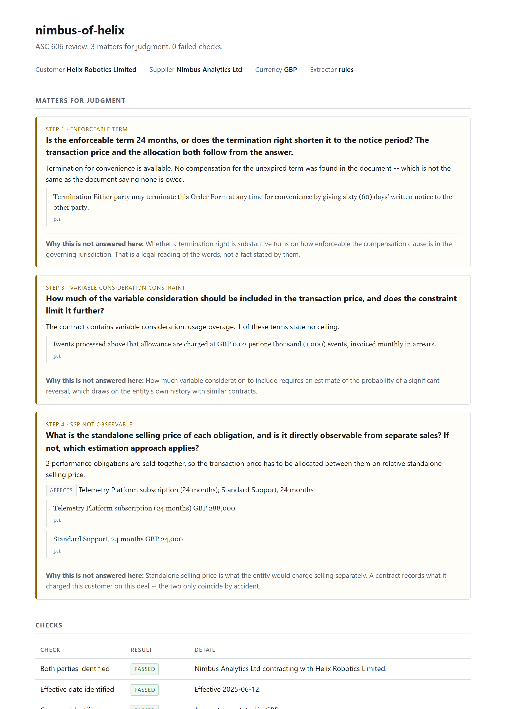
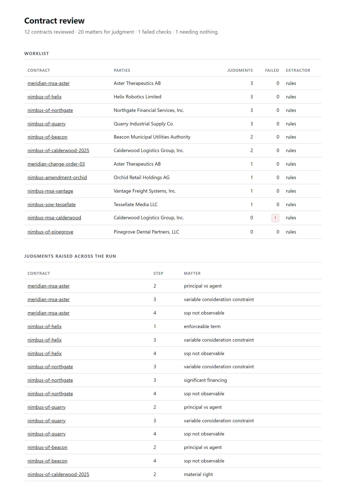

# revrec-contract-reviewer

[](https://github.com/gabriel-fin-arch/revrec-contract-reviewer/actions/workflows/ci.yml)

ASC 606 contract review for group-level revenue assurance. It reads executed
contract PDFs, extracts the facts that drive revenue recognition, tests them
against the five-step model, and writes a review memo in which **every value is
followed by the words it came from, the clause they sit in and the page**.

It does not conclude the accounting. What it does is put the eight judgments a
contract actually forces in front of the person who can make them, with the
evidence already pulled.



---

## The business problem

A group controller consolidating dozens of selling entities has a revenue
problem that has nothing to do with arithmetic. Each local team applies ASC 606
to its own contracts, on its own paper, and reports a number. By the time those
numbers arrive, the judgments behind them are invisible — a subsidiary that
treated a three-year subscription as three years of revenue and one that
treated the same clause as a rolling monthly contract both submit a clean
trial balance.

Nobody can read every contract. So the group asks for representations, samples
a handful at year end, and finds out about the interesting ones from the
auditors.

What is actually needed is narrower than "AI reads our contracts". It is a way
to open a folder of executed agreements and get back: which of these contain a
term that changes the accounting, where in the document it is, and which
question each one raises. That is a triage problem, and triage is a thing
software is good at.

## Why it needs domain knowledge

Three things in this repository would not be built this way by someone who
hadn't done the work.

**Standalone selling price is not in the contract.** Every schema I sketched
early on had an `ssp` field, and every one of them was quietly lying. SSP is
what the entity would charge selling separately; a contract is the price it
charged this customer on this deal. What the document does contain — the stated
price, the list rate on the order form, the renewal price — is captured, and
the SSP question is raised for someone with access to the entity's pricing
data. The same is true of the variable consideration constraint and of whether
a renewal discount is "incremental to the range typically given".

**A stated term and an enforceable term are different facts.** The corpus
contains a twenty-four month subscription that either party can exit on sixty
days' notice with an express statement that no further compensation is owed. If
that termination right is substantive, the enforceable contract is closer to
two months than to two years, and the transaction price the local team booked
is wrong by an order of magnitude. Both facts are extracted; neither is
resolved.

**The same clause type points in opposite directions.** Two contracts here
resell third-party goods. In one, the vendor grants the licence directly to the
customer, the cost is passed through without mark-up, and there is no warranty
obligation. In the other, the units are bought into inventory, priced at the
seller's discretion, installed and warranted by the seller. Every indicator
points one way in the first and the other way in the second. A rule keyed on
the phrase "third party" would get one of them badly wrong, which is the whole
argument for raising the question instead of answering it.

## Architecture

```
ingest    PDF -> pages with character offsets            pdfplumber
segment   numbered clauses, deterministic
extract   structured claims, each carrying a quote       Claude, or offline rules
ground    every quote located in the document, or dropped
assess    five-step checks and the judgment taxonomy     deterministic
memo      HTML with the evidence inline, plus JSON
```

Four of the five stages are deterministic. A model is involved in exactly one
of them, and everything it produces passes through `ground` before anything
downstream can see it.

**The design principle, and it is enforced rather than intended: the extractor
does not assert anything it cannot point at, and nothing is concluded from
outside the four corners of the document.**

The first half is executable. An extractor returns a value together with a
verbatim quote; grounding searches the document for that quote (whitespace- and
case-insensitively, with no fuzzy matching anywhere) and builds a citation only
if it is found. If the quote isn't there, the field is **dropped** — not
downgraded, not flagged as low confidence. A fact with no evidence is not a
weak fact.

The second half is the judgment taxonomy in
[docs/judgment-calls.md](docs/judgment-calls.md): eight decisions that stay with
a human because answering them needs information the contract does not contain.
That is a stronger position than a confidence threshold, because it survives
being asked to tune it.

There is no confidence score anywhere in the codebase. Fields have one of three
states — `extracted`, `ambiguous`, `absent` — and each drives a different
action. `extracted` means read the citation and move on. `ambiguous` means two
clauses contradict each other and someone has to decide which governs. `absent`
means go and read the document yourself, because nothing here covers it. A
blended 0.4 would have hidden the difference between the last two.

`absent` is careful not to claim the contract is silent, and the memo words it
as "not found" for that reason. An extractor that never looks for a field
produces exactly the same absence as a contract that never mentions one, and the
tool cannot tell them apart.

More in [docs/architecture.md](docs/architecture.md).

## Where the human is, and why

The memo leads with the judgments because they are the reason anyone opened it.
Each one states the question, what in the document raised it, the evidence, and
a standing reason it was not answered:

| Judgment | Why it isn't answered here |
|---|---|
| Enforceable term | Whether a termination penalty is substantive is a legal reading of the words, not a fact stated by them |
| Distinct or not | Depends on how the work is actually delivered, which the contract describes only in general terms |
| Principal vs agent | Control before transfer depends on the operating arrangement — inventory risk, pricing discretion, fulfilment |
| Material right | Requires the entity's typical discount range, which is pricing data, not a contract term |
| Variable consideration constraint | Requires an estimate of the probability of a significant reversal, from the entity's own history |
| Significant financing | Depends on intent and on prevailing rates at inception; neither is stated |
| Standalone selling price | A contract records what was charged on this deal, not what the entity would charge separately |
| Contract modification | Depends on whether added goods are distinct and priced at SSP — the modified agreement is a separate document |

Two of the twelve contracts in the corpus raise **no** judgments at all, and
that is measured. A reviewer that flags something on every contract is not a
reviewer; it is a smoke alarm with a stuck button, and a controller stops
reading it inside a month.

Across a folder, the same output is a worklist — ordered by everything needing
attention, failed checks included, so a contract the pipeline could not read
does not sink to the bottom looking like a clean one:



## Results

The pipeline is scored against a committed gold set. Full methodology, and an
honest account of what a synthetic corpus can and cannot tell you, in
[docs/evaluation.md](docs/evaluation.md).

Offline rule-based extractor, 12 contracts:

| Measure | Precision | Recall | F1 |
|---|---|---|---|
| Contract fields | 1.00 | 0.91 | 0.95 |
| Silence on unstated fields | 1.00 | 1.00 | 1.00 |
| Performance obligations | 0.79 | 0.75 | 0.77 |
| Judgment flags | 0.95 | 0.83 | 0.88 |

Citations re-resolved against the source: **210/210 (100%)**.

Those are the numbers for regular expressions, and they are published as the
baseline the model has to beat. A model extractor that can't beat regexes on a
corpus this clean isn't earning its cost. The recall gaps are all in the same
place: contracts that state their fees in prose rather than a fee table, and
the one clinical services agreement that grants a termination right without
using the words "for convenience". Every individual miss is listed by:

```bash
uv run revrec eval --extractor rules --mistakes
```

## Quickstart

Runs with no API key. The offline extractor is the default when one isn't set.

```bash
uv sync --extra dev
uv run revrec generate-corpus
uv run revrec review --extractor rules
```

That writes a memo per contract and a worklist index to `out/`. Open
`out/index.html`.

To use the model extractor, set `ANTHROPIC_API_KEY` (copy `.env.example` to
`.env`) and drop the flag:

```bash
uv run revrec review
uv run revrec eval --save
```

## What this does not do

Stated plainly, because an honest scope is more credible than an inflated one.

- **No OCR.** Text-layer PDFs only. A scanned contract is refused rather than
  silently returning an empty review.
- **No revenue schedule.** It does not compute the journal entry or the
  period-by-period waterfall. It reviews the contract.
- **No IFRS 16, and no IFRS 15 beyond where it converges with ASC 606.**
- **No layout understanding.** The model is given extracted text, not the PDF —
  see [docs/architecture.md](docs/architecture.md) for why that trade is made
  deliberately. Anything carried by position on the page is gone before the
  model sees it.
- **It does not replace technical review.** It prioritises and evidences. It
  does not conclude.

## The corpus

Twelve synthetic contracts: ten SaaS and software, two clinical services. Ten of
them are built around a specific ASC 606 question and two are deliberately built
around none. Every party, product, price and person is invented. See
[corpus/README.md](corpus/README.md) for what each one is there to exercise.

## Stack

Python 3.11+ · pydantic · pdfplumber · Anthropic SDK · jinja2 · typer ·
reportlab · pytest · ruff.

No agent framework. This is a pipeline with one model call in it, and wrapping
that in a graph would have added a dependency and a diagram without adding a
capability.

120 tests. CI runs ruff, the test suite, and then the whole pipeline offline
over the corpus; the eval step exits non-zero if any citation in any memo stops
resolving against its source document, which is the one regression that would
leave the tool untrustworthy while still looking like it worked.

```bash
uv run pytest -q
```

## Licence

MIT.
